# Jarkom-Modul-2-F06-2023

Kelompok F06:
- Arkana Bilal Imani / 5025211034
- Azhar Abiyu Rasendriya H. / 5025211177

## Daftar Isi

- [Laporan Resmi](#laporan-resmi)
  - [Daftar Isi](#daftar-isi)
  - [Topologi](#topologi)
  - [Konfig Node](#konfig)
- [No.1 - DNS](#Soal-1)
  - [Hasil Tes](#hasil)
- [No. 2 - DNS](#Soal-2)
  - [Hasil Tes](#hasil-1)
- [No. 3 - DNS](#Soal-3)
  - [Hasil Tes](#hasil-2)
- [No. 4 - DNS](#Soal-4)
  - [Hasil Tes](#hasil-3)
- [No. 5 - DNS](#Soal-5)
  - [Hasil Tes](#hasil-4)
- [No. 6 - DNS](#Soal-6)
  - [Hasil Tes](#hasil-5)
- [No. 7 - DNS](#Soal-7)
  - [Hasil Tes](#hasil-6)
- [No. 8 - DNS](#Soal-8)
  - [Hasil Tes](#hasil-7)
- [No. 9 & 10 - Webserver](#Soal-9-10)
  - [Hasil Tes](#hasil-8)

- [No. 11 - Webserver](#Soal-11)
  - [Hasil Tes](#hasil-10)
- [No. 12 - Webserver](#Soal-12)
  - [Hasil Tes](#hasil-11)
- [No. 13 - Webserver](#Soal-13)
  - [Hasil Tes](#hasil-12)
- [No. 14 - Webserver](#Soal-14)
  - [Hasil Tes](#hasil-13)
- [No. 15 - Webserver](#Soal-15)
  - [Hasil Tes](#hasil-14)
- [No. 16 - Webserver](#Soal-16)
  - [Hasil Tes](#hasil-15)
- [No. 17 - Webserver](#Soal-17)
  - [Hasil Tes](#hasil-16)
- [No. 18 - Webserver](#Soal-18)
  - [Hasil Tes](#hasil-17)
- [No. 19 - Webserver](#Soal-19)
  - [Hasil Tes](#hasil-18)
- [No. 20 - Webserver](#Soal-20)
  - [Hasil Tes](#hasil-19)
 
### Topologi

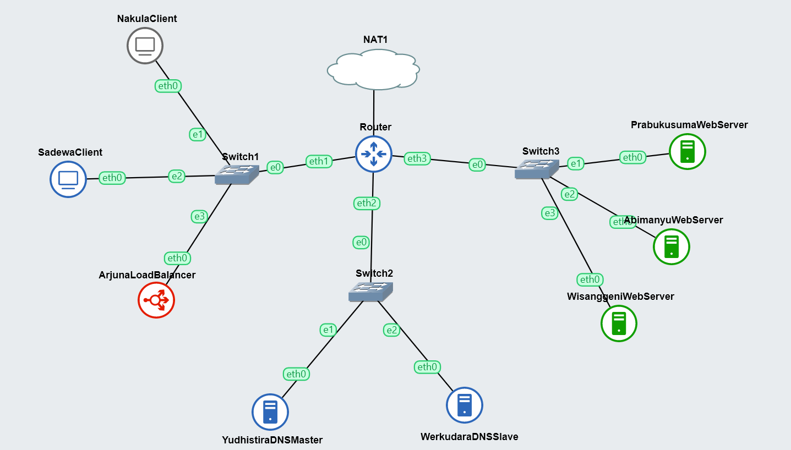

### Konfig

- Router
```
auto eth0
iface eth0 inet dhcp

auto eth1
iface eth1 inet static
	address 192.224.1.1
	netmask 255.255.255.0

auto eth2
iface eth2 inet static
	address 192.224.2.1
	netmask 255.255.255.0

auto eth3
iface eth3 inet static
	address 192.224.3.1
	netmask 255.255.255.0
```
- Switch 1
  - Nakula
    ```
    auto eth0
      iface eth0 inet static
	    address 192.224.1.2
	    netmask 255.255.255.0
	    gateway 192.224.1.1
    ```
  - Sadewa
    ```
    auto eth0
    iface eth0 inet static
	    address 192.224.1.3
    	netmask 255.255.255.0
    	gateway 192.224.1.1
    ```
  - Arjuna
    ```
    auto eth0
    iface eth0 inet static
	    address 192.224.1.4
	    netmask 255.255.255.0
	    gateway 192.224.1.1
    ```
- Switch 2
  - Yudhistira
    ```
    auto eth0
    iface eth0 inet static
    	address 192.224.2.2
    	netmask 255.255.255.0
    	gateway 192.224.2.1
    ```
  - Werkudara
    ```
    auto eth0
    iface eth0 inet static
    	address 192.224.2.3
    	netmask 255.255.255.0
    	gateway 192.224.2.1
    ```
- Switch 3
  - Prabukusuma
    ```
    auto eth0
    iface eth0 inet static
    	address 192.224.3.2
    	netmask 255.255.255.0
    	gateway 192.224.3.1
    ```
  - Abimanyu
    ```
    auto eth0
    iface eth0 inet static
    	address 192.224.3.3
    	netmask 255.255.255.0
    	gateway 192.224.3.1
    ```
  - Wisanggeni
    ```
    auto eth0
    iface eth0 inet static
    	address 192.224.3.4
    	netmask 255.255.255.0
    	gateway 192.224.3.1
    ```
## Soal-1

> Yudhistira akan digunakan sebagai DNS Master, Werkudara sebagai DNS Slave, Arjuna merupakan Load Balancer yang terdiri dari beberapa Web Server yaitu Prabakusuma, Abimanyu, dan Wisanggeni. Buatlah topologi dengan pembagian sebagai [berikut](https://docs.google.com/spreadsheets/d/1OqwQblR_mXurPI4gEGqUe7v0LSr1yJViGVEzpMEm2e8/edit#gid=1475903193). Folder topologi dapat diakses pada drive [berikut](https://drive.google.com/drive/folders/1Ij9J1HdIW4yyPEoDqU1kAwTn_iIxg3gk)  

Sebelum pengerjaan, langkah paling awal adalah menjalankan skrip setup.sh. Setelah itu dijalankan pengetesan untuk memastikan setiap node dapat terhubung ke router dan ke NAT. Pengetesan dilakukan dengan melakukan ping terhadap google.com

```shell
ping google.com -c 3
```
### Hasil


## Soal-2

> Buatlah website utama pada node arjuna dengan akses ke arjuna.yyy.com dengan alias www.arjuna.yyy.com dengan yyy merupakan kode kelompok.  

Langkah pertama adalah menjalankan skrip `setup.sh` di Yudhistira yang akan menginstall bind9 karena akan dibutuhkan untuk menjalankan DNS. Berikut adalah skrip tersebut.
```shell
echo nameserver 192.168.122.1 > /etc/resolv.conf
apt-get update
apt-get install bind9 -y
```
Setelah itu, langsung menjalankan skrip `arjunadns.sh` untuk membuat file konfigurasi DNS yang dibutuhkan seperti `named.conf.local` dan `arjuna.f06.com`

```shell
echo 'zone "arjuna.f06.com" {
        type master;
        file "/etc/bind/jarkom/arjuna.f06.com";
};' > /etc/bind/named.conf.local

mkdir /etc/bind/jarkom

cp /etc/bind/db.local /etc/bind/jarkom/arjuna.f06.com

echo ';
; BIND data file for local loopback interface
;
$TTL    604800
@       IN      SOA     arjuna.f06.com. root.arjuna.f06.com. (
                              2         ; Serial
                         604800         ; Refresh
                          86400         ; Retry
                        2419200         ; Expire
                         604800 )       ; Negative Cache TTL
;
@       IN      NS      arjuna.f06.com.
@       IN      A       192.224.1.4 ; IP Arjuna
www     IN      CNAME   arjuna.f06.com.
@       IN      AAAA    ::1' > /etc/bind/jarkom/arjuna.f06.com

service bind9 restart
```
Setelah itu, pindah ke client untuk menjalankan skrip `tesdns.sh` untuk melakukan tes apabila DNS di Yudhistira sudah berjalan atau belum.
```shell
echo nameserver 192.224.2.2 > /etc/resolv.conf

ping arjuna.f06.com -c 3
host -t CNAME www.arjuna.f06.com
ping www.arjuna.f06.com -c 3

ping abimanyu.f06.com -c 3
host -t CNAME www.abimanyu.f06.com
ping www.abimanyu.f06.com -c 3
```

### Hasil
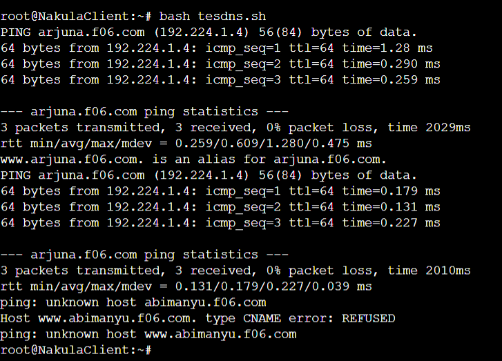
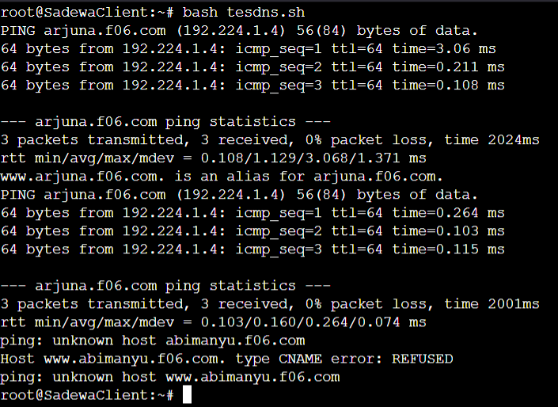

## Soal-3

> Dengan cara yang sama seperti soal nomor 2, buatlah website utama dengan akses ke abimanyu.yyy.com dan alias www.abimanyu.yyy.com.  

Langkahnya mirip dengan nomor 2, namun dengan perbedaan di nama domain dan file yang dibuat. Skrip yang dijalankan adalah `abimanayudns.sh` dan tetap dijalankan di Yudhistira.
```shell

echo 'zone "arjuna.f06.com" {
    type master;
    file "/etc/bind/jarkom/arjuna.f06.com";
};

zone "abimanyu.f06.com" {
    type master;
    file "/etc/bind/jarkom/abimanyu.f06.com";
};' > /etc/bind/named.conf.local


cp /etc/bind/db.local /etc/bind/jarkom/abimanyu.f06.com

echo ';
; BIND data file for local loopback interface
;
$TTL    604800
@       IN      SOA     abimanyu.f06.com. root.abimanyu.f06.com. (
                              2         ; Serial
                         604800         ; Refresh
                          86400         ; Retry
                        2419200         ; Expire
                         604800 )       ; Negative Cache TTL
;
@       IN      NS      abimanyu.f06.com.
@       IN      A       192.224.3.3 ; IP Abimanyu
www     IN      CNAME   abimanyu.f06.com.
@       IN      AAAA    ::1' > /etc/bind/jarkom/abimanyu.f06.com

service bind9 restart
```
Setelah itu pindah lagi ke client untuk menjalankan skrip `tesdns.sh` karena didalam skrip tersebut sudah ada command yang mengetes domain abimanyu.f06.com juga.
```shell
echo nameserver 192.224.2.2 > /etc/resolv.conf

ping arjuna.f06.com -c 3
host -t CNAME www.arjuna.f06.com
ping www.arjuna.f06.com -c 3

ping abimanyu.f06.com -c 3
host -t CNAME www.abimanyu.f06.com
ping www.abimanyu.f06.com -c 3
```
Skrip `tesdns.sh` tersebut juga berguna untuk memberitahu apakah `www.abimanyu.f06.com` dan `www.arjuna.f06.com` adalah CNAME dari domain yang dites.
### Hasil
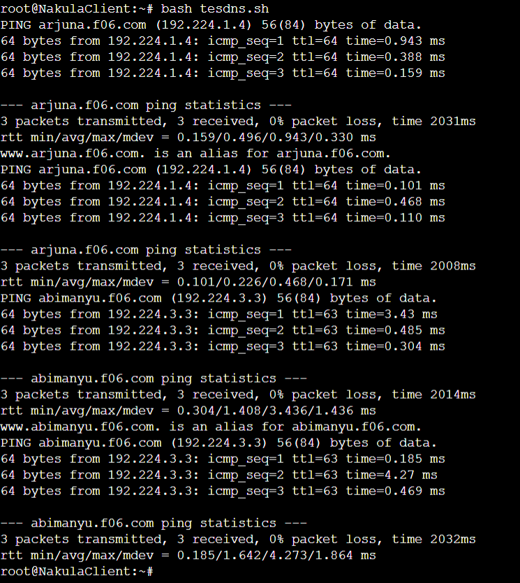
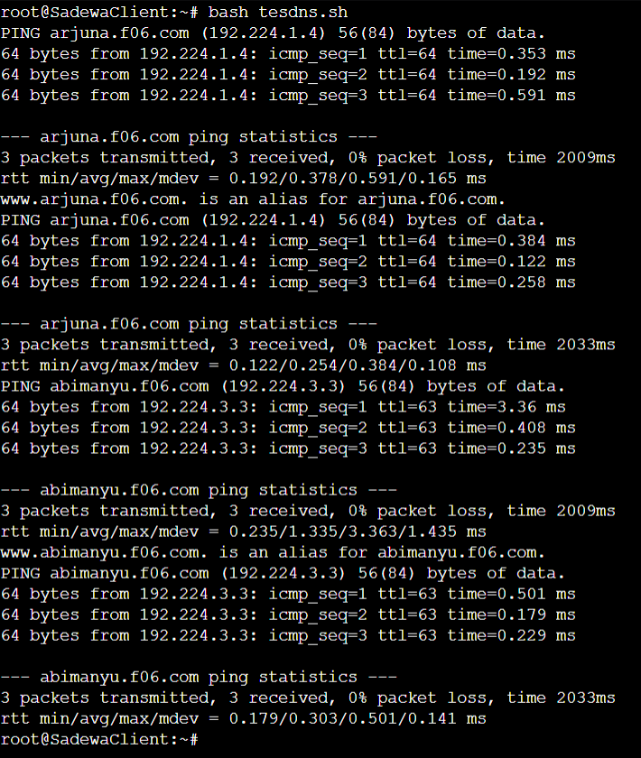

## Soal-4

> Kemudian, karena terdapat beberapa web yang harus di-deploy, buatlah subdomain parikesit.abimanyu.yyy.com yang diatur DNS-nya di Yudhistira dan mengarah ke Abimanyu.  

Untuk membuat subdomain parikesit, yang ditambahkan adalah `parikesit IN A 192.224.3.3` pada file `abimanyu.f06.com`. Berikut adalah skrip bernama `parikesit.sh` di Yudhistira yang dapat menambahkan potongan kode tersebut.
```shell
echo ';
; BIND data file for local loopback interface
;
$TTL    604800
@       IN      SOA     abimanyu.f06.com. root.abimanyu.f06.com. (
                              2         ; Serial
                         604800         ; Refresh
                          86400         ; Retry
                        2419200         ; Expire
                         604800 )       ; Negative Cache TTL
;
@       IN      NS      abimanyu.f06.com.
@       IN      A       192.224.3.3 ; IP Abimanyu
www     IN      CNAME   abimanyu.f06.com.
parikesit   IN  A       192.224.3.3
@       IN      AAAA    ::1' > /etc/bind/jarkom/abimanyu.f06.com

service bind9 restart
```
Lalu, gunakan skrip `parikesittes.sh` yang ada pada client untuk mengetes apakah subdomain tersebut sudah jalan atau tidak.
```shell
ping parikesit.abimanyu.f06.com -c 5
host -t A parikesit.abimanyu.f06.com
```
Skrip tersebut juga mencari tahu ke IP apa subdomain tersebut menunjuk dengan menggunakan command `host -t A`.

### Hasil
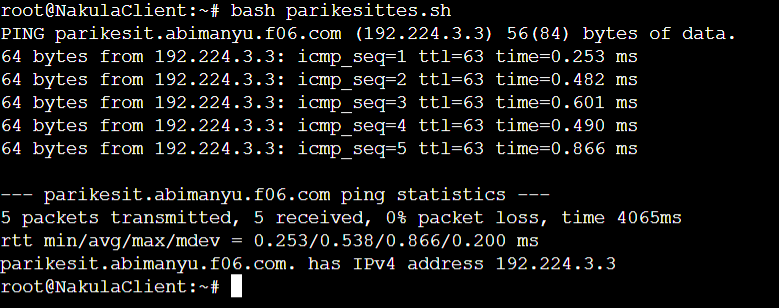
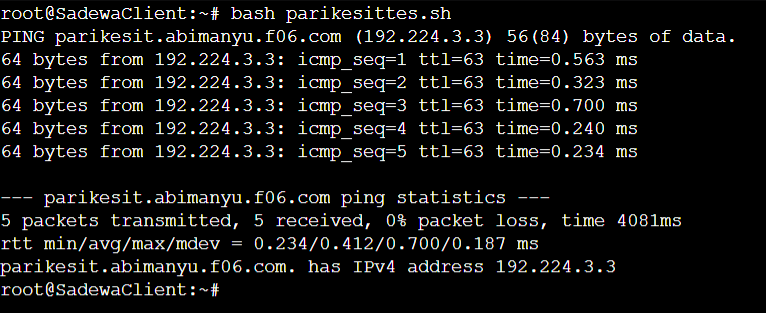


## Soal-5

> Buat juga reverse domain untuk domain utama. (Abimanyu saja yang direverse)  

Untuk melakukan konfigurasi reverse DNS, diperlukan IP dari abimanyu, yaitu `192.224.3.3`. Setelah dapat IP tersebut, maka langsung saja direverse atau dibalik menjadi `3.3.224.192`. Reversed IP tersebut yang akan dikonfigurasikan untuk menunjuk ke domain `abimanyu.f06.com`. Berikut adalah skrip bernama `reversedns.sh` di Yudhistira yang dapat membuat konfigurasi tersebut.
```shell
echo 'zone "arjuna.f06.com" {
    type master;
    file "/etc/bind/jarkom/arjuna.f06.com";
};

zone "abimanyu.f06.com" {
    type master;
    file "/etc/bind/jarkom/abimanyu.f06.com";
};
zone "2.224.192.in-addr.arpa" {
        type master;
        file "/etc/bind/jarkom/2.224.192.in-addr.arpa";
};' > /etc/bind/named.conf.local

cp /etc/bind/db.local /etc/bind/jarkom/2.224.192.in-addr.arpa

echo ';
; BIND data file for local loopback interface
;
$TTL    604800
@       IN      SOA     abimanyu.f06.com. root.abimanyu.f06.com. (
                              2         ; Serial
                         604800         ; Refresh
                          86400         ; Retry
                        2419200         ; Expire
                         604800 )       ; Negative Cache TTL
;
2.224.192.in-addr.arpa.  IN      NS      abimanyu.f06.com.
2                        IN      PTR     abimanyu.f06.com. ; byte 4 Yudhistira' > /etc/bind/jarkom/2.224.192.in-addr.arpa

service bind9 restart
```
Setelah melakukan konfigurasi di Yudhistira, dapat dites di client menggunakan skrip `reversedns.sh` seperti berikut.
```shell
echo nameserver 192.224.2.2 > /etc/resolv.conf
host -t PTR 192.224.2.2
```
Command `host -t PTR` digunakan untuk mencari tahu kemana `192.224.3.3` menunjuk.
### Hasil
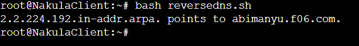
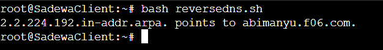

## Soal-6

> Agar dapat tetap dihubungi ketika DNS Server Yudhistira bermasalah, buat juga Werkudara sebagai DNS Slave untuk domain utama.

Karena nomor ini sudah mulai menggunakan Werkudara sebagai DNS slave, maka perlu diinstall bind9 di Werkudara dengan menggunakan skrip `setup.sh` seperti berikut.
```shell
echo nameserver 192.168.122.1 > /etc/resolv.conf
apt-get update
apt-get install bind9 -y
```
Untuk membuat sistem DNS master-slave, maka perlu dilakukan konfigurasi DNS master di Yudhistira menggunakan skrip `master.sh` seperti berikut,
```shell
echo 'zone "arjuna.f06.com" {
    type master;
    notify yes;
    also-notify {192.224.2.3;};
    allow-transfer {192.224.2.3;};
    file "/etc/bind/jarkom/arjuna.f06.com";
};

zone "abimanyu.f06.com" {
    type master;
    notify yes;
    also-notify {192.224.2.3;};
    allow-transfer {192.224.2.3;};
    file "/etc/bind/jarkom/abimanyu.f06.com";
};

zone "2.224.192.in-addr.arpa" {
        type master;
        file "/etc/bind/jarkom/2.224.192.in-addr.arpa";
};' > /etc/bind/named.conf.local

service bind9 restart
```
dan konfigurasi DNS slave di Werkudara menggunakan skrip `slave.sh` seperti berikut.
```shell
echo '
zone "arjuna.f06.com" {
    type slave;
    masters { 192.224.2.2; }; 
    file "/var/lib/bind/arjuna.f06.com";
};

zone "abimanyu.f06.com" {
    type slave;
    masters { 192.224.2.2; }; 
    file "/var/lib/bind/abimanyu.f06.com";
};' > /etc/bind/named.conf.local

service bind9 restart
```
Setelah konfigurasi tersebut sudah jadi, maka bisa langsung dilakukan tes dengan memberhentikan service bind9 di Yudhistira dengan command berikut:
```shell
service bind9 stop
```
Untuk melakukan tes, bisa dengan skrip `slavemastertes.sh` di client sebagai berikut.
```shell
echo nameserver 192.224.2.2 > /etc/resolv.conf
echo nameserver 192.224.2.3 >> /etc/resolv.conf

ping abimanyu.f06.com -c 3
ping arjuna.f06.com -c 3
```
Apabila ping dapat berjalan, maka DNS slave sudah berjalan di Werkudara pada saat DNS master di yudhistira sudah mati. Setelah dilakukan tes tersebut jangan lupa untuk dinyalakan lagi bind9 di Yudhistira dengan comman berikut.
```shell
service bind9 start
```

### Hasil
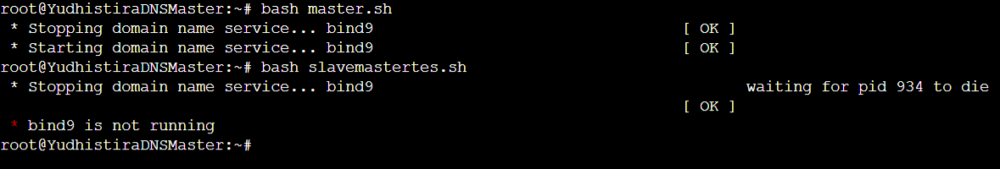
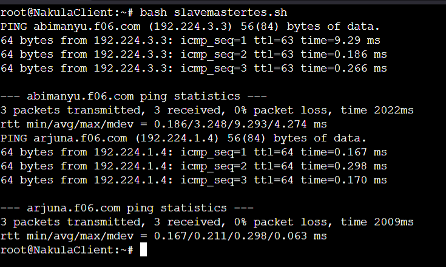

## Soal-7

> Seperti yang kita tahu karena banyak sekali informasi yang harus diterima, buatlah subdomain khusus untuk perang yaitu baratayuda.abimanyu.yyy.com dengan alias www.baratayuda.abimanyu.yyy.com yang didelegasikan dari Yudhistira ke Werkudara dengan IP menuju ke Abimanyu dalam folder Baratayuda.  

Untuk membuat konfigurasi delegasi, file yang diedit tidak hanya `named.conf.local` dan file DNS yang sudah dibuat seperti `abimanyu.f06.com`, tetapi juga file `named.conf.options`. Semua konfigurasi tersebut dapat langsung dijalankan dengan skrip `delegasi.sh` di Yudhistira yang berisi sebagai berikut.
```shell
echo ';
; BIND data file for local loopback interface
;
$TTL    604800
@       IN      SOA     abimanyu.f06.com. root.abimanyu.f06.com. (
                              2         ; Serial
                         604800         ; Refresh
                          86400         ; Retry
                        2419200         ; Expire
                         604800 )       ; Negative Cache TTL
;
@               IN      NS      abimanyu.f06.com.
@               IN      A       192.224.3.3 ; IP Abimanyu
www             IN      CNAME   abimanyu.f06.com.
parikesit       IN      A       192.224.3.3
ns1             IN      A       192.224.2.3
baratayuda      IN      NS      ns1
@               IN      AAAA    ::1' > /etc/bind/jarkom/abimanyu.f06.com

echo 'options {
        directory "/var/cache/bind";
        //dnssec-validation auto;
        allow-query{any;};

        auth-nxdomain no;    # conform to RFC1035
        listen-on-v6 { any; };
};' > /etc/bind/named.conf.options

echo 'zone "arjuna.f06.com" {
    type master;
    notify yes;
    also-notify {192.224.2.3;};
    allow-transfer {192.224.2.3;};
    file "/etc/bind/jarkom/arjuna.f06.com";
};

zone "abimanyu.f06.com" {
    type master;
    notify yes;
    also-notify {192.224.2.3;};
    allow-transfer {192.224.2.3;};
    file "/etc/bind/jarkom/abimanyu.f06.com";
};

zone "2.224.192.in-addr.arpa" {
        type master;
        file "/etc/bind/jarkom/2.224.192.in-addr.arpa";
};' > /etc/bind/named.conf.local

service bind9 restart
```
Setelah konfigurasi di Yudhistira sudah aman, bisa lanjut konfigurasi di Werkudara dengan skrip `delegasi.sh` yang berisi sebagai berikut.
```shell
echo 'options {
        directory "/var/cache/bind";
        //dnssec-validation auto;
        allow-query{any;};

        auth-nxdomain no;    # conform to RFC1035
        listen-on-v6 { any; };
};' > /etc/bind/named.conf.options

echo '
zone "baratayuda.abimanyu.f06.com" {
    type master;
    file "/etc/bind/baratayuda/baratayuda.abimanyu.f06.com";
};' >> /etc/bind/named.conf.local

mkdir /etc/bind/baratayuda
cp /etc/bind/db.local /etc/bind/baratayuda/baratayuda.abimanyu.f06.com

echo ';
; BIND data file for local loopback interface
;
$TTL    604800
@       IN      SOA     baratayuda.abimanyu.f06.com. root.baratayuda.abimanyu.f06.com. (
                              2         ; Serial
                         604800         ; Refresh
                          86400         ; Retry
                        2419200         ; Expire
                         604800 )       ; Negative Cache TTL
;
@       IN      NS      baratayuda.abimanyu.f06.com.
@       IN      A       192.224.3.3 ; IP Abimanyu
www     IN      CNAME   baratayuda.abimanyu.f06.com.' > /etc/bind/baratayuda/baratayuda.abimanyu.f06.com

service bind9 restart
```
Werkudara yang akan menghandle CNAME `www` pada subdomain `baratayuda.abimanyu.f06.com`.  
Setelah itu bisa langsung dites di client menggunakan skrip `delegasites.sh` seperti berikut.
```shell
ping baratayuda.abimanyu.f06.com -c 3
ping www.baratayuda.abimanyu.f06.com -c 3
```
### Hasil
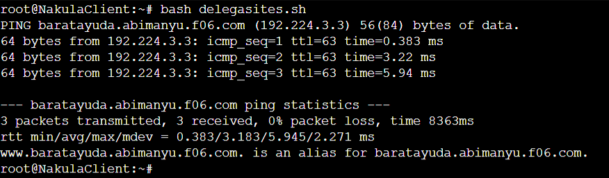
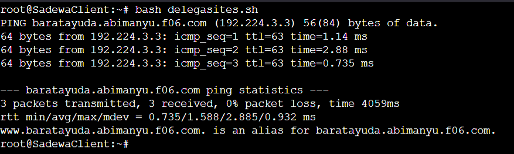

## Soal-8

> Untuk informasi yang lebih spesifik mengenai Ranjapan Baratayuda, buatlah subdomain melalui Werkudara dengan akses rjp.baratayuda.abimanyu.yyy.com dengan alias www.rjp.baratayuda.abimanyu.yyy.com yang mengarah ke Abimanyu.  

Untuk menambahkan subdomain `rjp.baratayuda.abimanyu.f06.com` di Werkudara, tinggal menambahkan potongan konfigurasi berikut.
```
rjp     IN      A       192.224.3.3
www.rjp IN      CNAME   baratayuda.abimanyu.f06.com.
```
Potongan konfigurasi tersebut dapat ditambahkan dengan skrip `rjp.sh` yang berada di Werkudara.
```shell
echo ';
; BIND data file for local loopback interface
;
$TTL    604800
@       IN      SOA     baratayuda.abimanyu.f06.com. root.baratayuda.abimanyu.f06.com. (
                              2         ; Serial
                         604800         ; Refresh
                          86400         ; Retry
                        2419200         ; Expire
                         604800 )       ; Negative Cache TTL
;
@       IN      NS      baratayuda.abimanyu.f06.com.
@       IN      A       192.224.3.3 ; IP Abimanyu
www     IN      CNAME   baratayuda.abimanyu.f06.com.
rjp     IN      A       192.224.3.3
www.rjp IN      CNAME   baratayuda.abimanyu.f06.com.' > /etc/bind/baratayuda/baratayuda.abimanyu.f06.com

service bind9 restart
```
Setelah itu bisa langsung dites dengan menggunakan skrip `rjptes.sh` di client.
```shell
echo nameserver 192.224.2.3 > /etc/resolv.conf

ping rjp.baratayuda.abimanyu.f06.com -c 3
ping www.rjp.baratayuda.abimanyu.f06.com -c 3
host -t CNAME www.rjp.baratayuda.abimanyu.f06.com
```
List `nameserver` di `/etc/resolv.conf` dibersihkan dan diset pada IP Werkudara(`192.224.2.3`) saja karena apabila tidak, host -t CNAME tidak akan mencari CNAME langsung di Werkudara, namun akan mencari di Yudhistira terlebih dahulu. Setelah tes dilakukan, jalankan skrip `defaultname.sh` untuk mengembalikan list `nameserver` untuk mengarah ke Yudhistira dan Werkudara.
```shell
echo nameserver 192.224.2.2 > /etc/resolv.conf
echo nameserver 192.224.2.3 >> /etc/resolv.conf
```
### Hasil
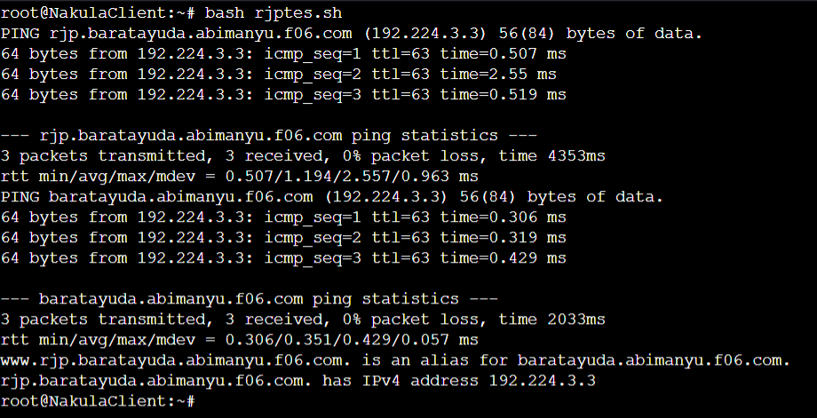
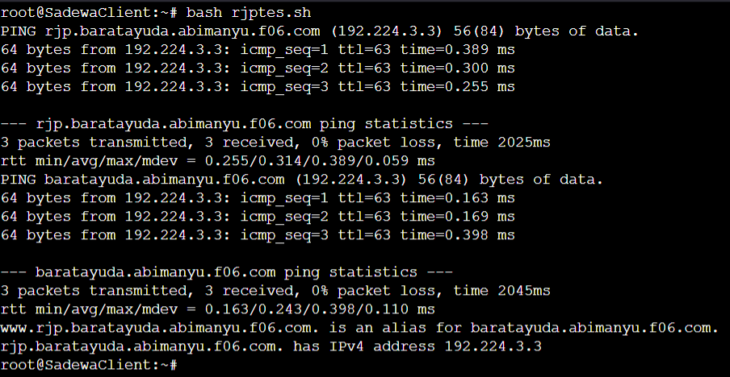

## Soal-9-10

> Arjuna merupakan suatu Load Balancer Nginx dengan tiga worker (yang juga menggunakan nginx sebagai webserver) yaitu Prabakusuma, Abimanyu, dan Wisanggeni. Lakukan deployment pada masing-masing worker.  
> Kemudian gunakan algoritma Round Robin untuk Load Balancer pada Arjuna. Gunakan server_name pada soal nomor 1. Untuk melakukan pengecekan akses alamat web tersebut kemudian pastikan worker yang digunakan untuk menangani permintaan akan berganti ganti secara acak. Untuk webserver di masing-masing worker wajib berjalan di port 8001-8003. Contoh (Prabakusuma:8001, Abimanyu:8002, Wisanggeni:8003)

Sebelum melakukan konfigurasi, Arjuna, Prabakusuma, Abimanyu, dan Wisanggeni perlu diinstallkan nginx dan php. Dapat menggunakan skrip `setup.sh` berikut.
```shell
echo nameserver 192.168.122.1 > /etc/resolv.conf
apt-get update && apt install nginx php php-fpm -y
php -v
```

Untuk membuat Prabakusuma, Abimanyu, dan Wisanggeni menjadi webserver, dibutuhkan beberapa konfigurasi untuk nginx dan webserver yang akan ditampilkan dalam bentuk index.php yang bisa dibuat dengan skrip `nginx.sh` berikut.
```shell

mkdir /var/www/jarkom
touch /var/www/jarkom/index.php

echo ' <?php
echo "Halo, Kamu berada di xxx";
?>' > /var/www/jarkom/index.php

touch /etc/nginx/sites-available/jarkom

echo 'server {

	listen 800x;

	root /var/www/jarkom;

	index index.php index.html index.htm;
	server_name 192.224.3.x;

	location / {
			try_files $uri $uri/ /index.php?$query_string;
	}

	# pass PHP scripts to FastCGI server
	location ~ \.php$ {
	include snippets/fastcgi-php.conf;
	fastcgi_pass unix:/var/run/php/php7.0-fpm.sock;
	}

location ~ /\.ht {
			deny all;
	}

	error_log /var/log/nginx/jarkom_error.log;
	access_log /var/log/nginx/jarkom_access.log;
}' > /etc/nginx/sites-available/jarkom

ln -s /etc/nginx/sites-available/jarkom /etc/nginx/sites-enabled

service nginx restart

service php7.0-fpm start
service php7.0-fpm restart

rm -rf /etc/nginx/sites-enabled/default

nginx -t
```
String `xxx` dalam file index.php tersebut dapat diganti sesuai dengan letak webserver untuk menandakan bahwa load balancer di Arjuna sudah bekerja. 
Untuk bagian `listen 800x` digunakan untuk mendefinisikan setiap webserver akan mendengarkan dari port berapa. Sebenarnya bagian ini untuk nomor 11, tetapi langsung dijalankan saja supaya tidak bingung mengganti lagi. Begitu juga dengan `server_name` yang diset sesuai dengan IP dari worker masing masing webserver.  

Untuk Arjuna sendiri, dapat digunakan skrip `loadbalancer.sh`  seperti berikut.
```shell
touch /etc/nginx/sites-available/lb-arjuna

echo '# Default menggunakan Round Robin
upstream myweb  {
	server 192.224.3.4:8003; #IP Wisanggeni
	server 192.224.3.3:8002; #IP Abimanyu
    server 192.224.3.2:8001; #IP Prabakusuma
}

server {
	listen 80;
	server_name arjuna.f06.com;

	location / {
	proxy_pass http://myweb;
	}
}' > /etc/nginx/sites-available/lb-arjuna

ln -s /etc/nginx/sites-available/lb-arjuna /etc/nginx/sites-enabled

service nginx start
service nginx restart

nginx -t
```
Pembagian setiap port untuk setiap worker dilakukan di load balancer. Untuk `server_name` diset sebagai domain yang akan mengakses load balancer ini, yaitu `arjuna.f06.com`.

Untuk mengetes apakah load balancer sudah berjalan, bisa menggunakan command berikut.
```shell
lynx arjuna.f06.com
```
Setelah itu untuk mengunjungi setiap worker, karena menggunakan algoritma round robin, langsung refresh tampilan lynx dengan menggunakan `ctrl-r`.
### Hasil
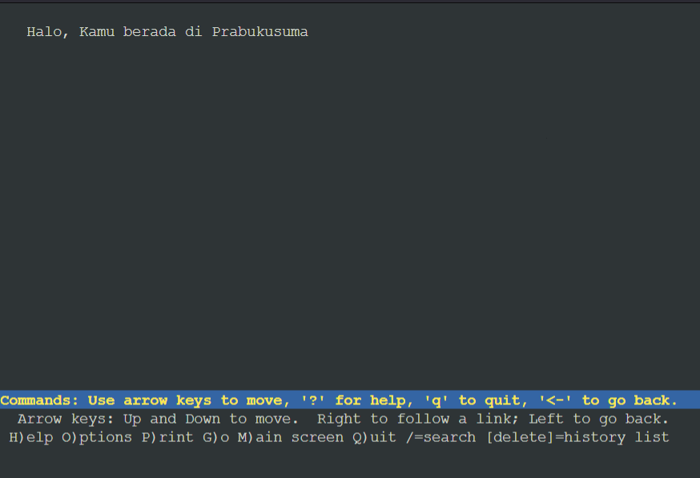
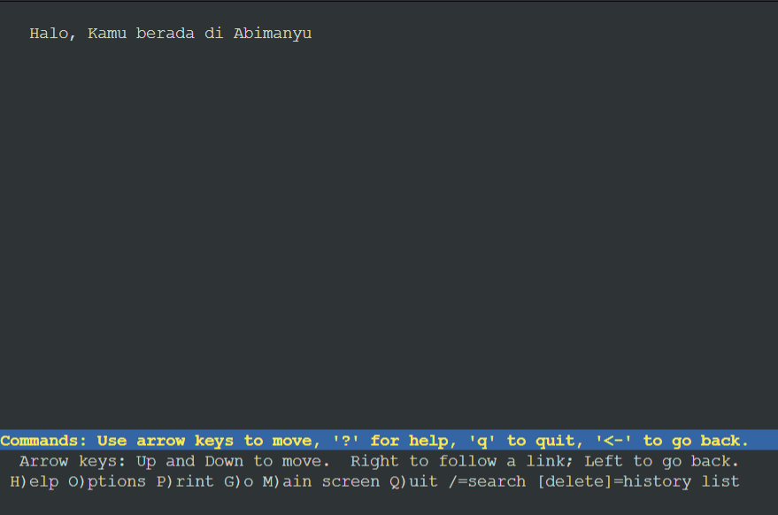
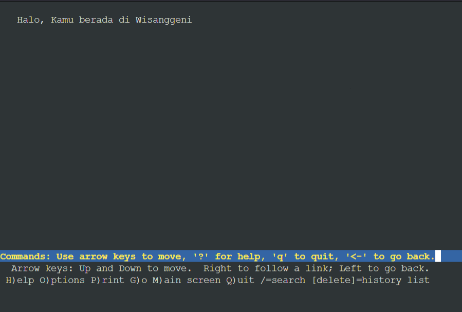


## Soal-11

> Selain menggunakan Nginx, lakukan konfigurasi Apache Web Server pada worker Abimanyu dengan web server www.abimanyu.yyy.com. Pertama dibutuhkan web server dengan DocumentRoot pada /var/www/abimanyu.yyy  

Untuk melakukan konfigurasi apache di Abimanyu, perlu untuk menginstall apache dan memberhentikan nginx terlebih dahulu. Bisa menggunakan skrip `apache.sh` berikut.
```shell
apt-get update
apt-get install apache2 -y
apt-get install libapache2-mod-php7.0 -y

service apache2 start
service nginx stop
```
Setelah itu, dapat dibuat file `.conf` di folder `sites-available` untuk mengkonfigurasikan server apachenya. Selain itu file `ports.conf` juga diedit untuk mendengarkan port 8002. Setelah itu barulah server di Abimanyu di enable dengan `a2ensite`. Semua itu dapat digunakan dengan skrip `settingapache.sh` berikut.
```shell

cp /etc/apache2/sites-available/000-default.conf /etc/apache2/sites-available/8002.conf
echo '<VirtualHost *:8002>

        ServerAdmin webmaster@localhost
        DocumentRoot /var/www/abimanyu.f06
        ServerName abimanyu.f06.com
        ServerAlias www.abimanyu.f06.com
        
        <Directory /var/www/abimanyu.f06>
            Options +FollowSymLinks -Multiviews
            AllowOverride All
        </Directory>

        ErrorLog ${APACHE_LOG_DIR}/error.log
        CustomLog ${APACHE_LOG_DIR}/access.log combined

</VirtualHost>' > /etc/apache2/sites-available/8002.conf


cp /etc/apache2/sites-available/000-default.conf /etc/apache2/sites-available/abimanyu.f06.com.conf
echo '<VirtualHost *:80>

        ServerAdmin webmaster@localhost
        DocumentRoot /var/www/abimanyu.f06
        ServerName abimanyu.f06.com
        ServerAlias www.abimanyu.f06.com

        <Directory /var/www/abimanyu.f06>
            Options +FollowSymLinks -Multiviews
            AllowOverride All
        </Directory>

        ErrorLog ${APACHE_LOG_DIR}/error.log
        CustomLog ${APACHE_LOG_DIR}/access.log combined

</VirtualHost>' > /etc/apache2/sites-available/abimanyu.f06.com.conf

echo 'Listen 80
Listen 8002

<IfModule ssl_module>
        Listen 443
</IfModule>

<IfModule mod_gnutls.c>
        Listen 443
</IfModule>' > /etc/apache2/ports.conf

a2ensite 8002.conf
a2ensite abimanyu.f06.com.conf
service apache2 reload
```
Karena sitenya sendiri belum dibuat, dan harus menggunakan file webserver yang telah disediakan di resources, maka dapat menggunakan skrip `download.sh` berikut.
```shell

apt-get install wget -y
apt-get install unzip -y

# wget --no-check-certificate 'https://docs.google.com/uc?export=download&id=1a4V23hwK9S7hQEDEcv9FL14UkkrHc-Zc' -O abimanyu.f06.com.zip
# wget --no-check-certificate 'https://docs.google.com/uc?export=download&id=1LdbYntiYVF_NVNgJis1GLCLPEGyIOreS' -O parikesit.abimanyu.f06.com.zip
# wget --no-check-certificate 'https://docs.google.com/uc?export=download&id=1pPSP7yIR05JhSFG67RVzgkb-VcW9vQO6' -O rjp.baratayuda.abimanyu.f06.com.zip

unzip abimanyu.f06.com.zip
mv -v abimanyu.yyy.com/* /var/www/abimanyu.f06/
rm -rf abimanyu.yyy.com

unzip parikesit.abimanyu.f06.com.zip
mv -v parikesit.abimanyu.yyy.com/* /var/www/parikesit.abimanyu.f06/
rm -rf parikesit.abimanyu.yyy.com

unzip rjp.baratayuda.abimanyu.f06.com.zip
mv -v rjp.baratayuda.abimanyu.yyy.com/* /var/www/rjp.baratayuda.abimanyu.f06/
rm -rf rjp.baratayuda.abimanyu.yyy.com
```
Setelah itu langsung saja bisa dicek dengan menggunakan command berikut.
```shell
lynx abimanyu.f06.com
```
### Hasil
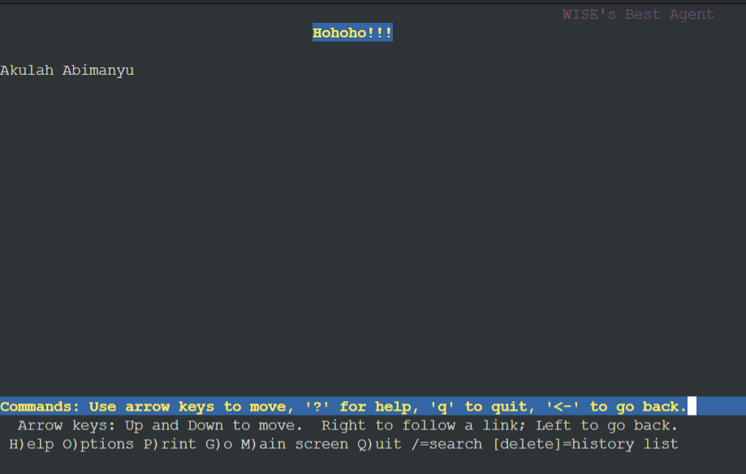

## Soal-12

> Setelah itu ubahlah agar url www.abimanyu.yyy.com/index.php/home menjadi www.abimanyu.yyy.com/home.

Dengan menyalakan module rewrite, www.abimanyu.yyy.com/index.php/home dapat disingkat menjadi www.abimanyu.yyy.com/home saja. Jalankan skrip `rewrite.sh` berikut.
```shell
a2enmod rewrite
service apache2 restart

touch /var/www/abimanyu.f06/.htaccess
echo 'RewriteEngine On

RewriteCond %{REQUEST_FILENAME} !-f
RewriteCond %{REQUEST_FILENAME} !-d
RewriteRule ^(.*)$ index.php/$1 [L]' > /var/www/abimanyu.f06/.htaccess

service apache2 restart
```
Setelah itu langsung coba dengan command berikut.
```shell
lynx www.abimanyu.f06.com/home
```
Apabila hasilnya sama dengan nomer 11, maka module rewrite tersebut sudah berjalan.
### Hasil


## Soal-13

> Selain itu, pada subdomain www.parikesit.abimanyu.yyy.com, DocumentRoot disimpan pada /var/www/parikesit.abimanyu.yyy

lakukan konfigurasi pada Abimanyu menggunakan skrip `parikesit.sh` yang berisi sebagai berikut.
```shell
cp /etc/apache2/sites-available/000-default.conf /etc/apache2/sites-available/parikesit.abimanyu.f06.com.conf
echo '<VirtualHost *:80>

        ServerAdmin webmaster@localhost
        DocumentRoot /var/www/parikesit.abimanyu.f06
        ServerName parikesit.abimanyu.f06.com
        ServerAlias www.parikesit.abimanyu.f06.com

        ErrorLog ${APACHE_LOG_DIR}/error.log
        CustomLog ${APACHE_LOG_DIR}/access.log combined

</VirtualHost>' > /etc/apache2/sites-available/parikesit.abimanyu.f06.com.conf

a2ensite parikesit.abimanyu.f06.com.conf

service apache2 restart
```
lalu jalankan skrip `apacheparikesit.sh` di Yudhistira
```shell
echo ';
; BIND data file for local loopback interface
;
$TTL    604800
@       IN      SOA     abimanyu.f06.com. root.abimanyu.f06.com. (
                              2         ; Serial
                         604800         ; Refresh
                          86400         ; Retry
                        2419200         ; Expire
                         604800 )       ; Negative Cache TTL
;
@               IN      NS      abimanyu.f06.com.
@               IN      A       192.224.3.3 ; IP Abimanyu
www             IN      CNAME   abimanyu.f06.com.
parikesit       IN      A       192.224.3.3
www.parikesit   IN      CNAME   abimanyu.f06.com.
ns1             IN      A       192.224.2.3
baratayuda      IN      NS      ns1
@               IN      AAAA    ::1' > /etc/bind/jarkom/abimanyu.f06.com 

service bind9 restart
```
lalu jalankan skrip `apacheparikesit.sh` di Nakula / Sadewa
```shell
lynx www.parikesit.abimanyu.f06.com
```


### Hasil
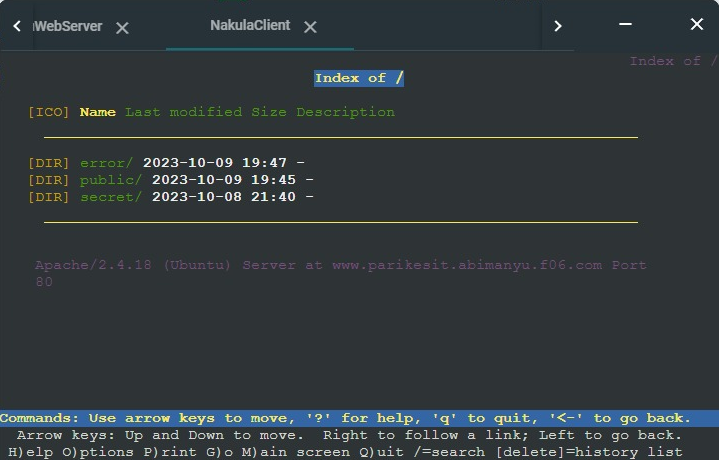


## Soal-14

> Pada subdomain tersebut folder /public hanya dapat melakukan directory listing sedangkan pada folder /secret tidak dapat diakses (403 Forbidden).

lakukan konfigurasi pada Abimanyu menggunakan skrip `publicsecret.sh` yang berisi sebagai berikut.
```shell
echo '<VirtualHost *:80>

        ServerAdmin webmaster@localhost
        DocumentRoot /var/www/parikesit.abimanyu.f06
        ServerName parikesit.abimanyu.f06.com
        ServerAlias www.parikesit.abimanyu.f06.com

        <Directory /var/www/parikesit.abimanyu.f06/public>
            Options +Indexes
        </Directory>

        <Directory /var/www/parikesit.abimanyu.f06/secret>
            Options -Indexes
        </Directory>

        ErrorLog ${APACHE_LOG_DIR}/error.log
        CustomLog ${APACHE_LOG_DIR}/access.log combined

</VirtualHost>' > /etc/apache2/sites-available/parikesit.abimanyu.f06.com.conf

service apache2 restart
```
lalu jalankan skrip `apacheparikesit.sh` di Nakula / Sadewa
```shell
lynx www.parikesit.abimanyu.f06.com
```

### Hasil
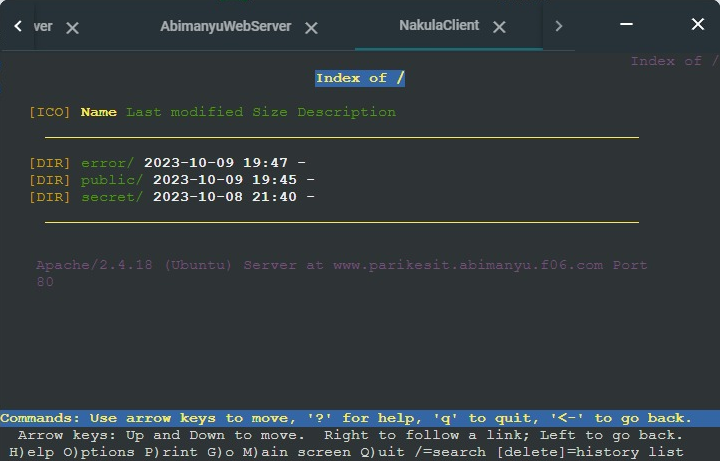


## Soal-15

> Buatlah kustomisasi halaman error pada folder /error untuk mengganti error kode pada Apache. Error kode yang perlu diganti adalah 404 Not Found dan 403 Forbidden.

Untuk membuat kustomisasi halaman error pada folder /error untuk mengganti error kode pada Apache, Error kode yang perlu diganti adalah 404 Not Found dan 403 Forbidden, melakukan konfigurasi pada Abimanyu dengan script `error.sh` yang berisi sebagai berikut.

```shell
echo '<VirtualHost *:80>

        ServerAdmin webmaster@localhost
        DocumentRoot /var/www/parikesit.abimanyu.f06
        ServerName parikesit.abimanyu.f06.com
        ServerAlias www.parikesit.abimanyu.f06.com

        <Directory /var/www/parikesit.abimanyu.f06/public>
            Options +Indexes
        </Directory>

        <Directory /var/www/parikesit.abimanyu.f06/secret>
            Options -Indexes
        </Directory>

        ErrorDocument 403 /error/403.html
        ErrorDocument 404 /error/404.html

        ErrorLog ${APACHE_LOG_DIR}/error.log
        CustomLog ${APACHE_LOG_DIR}/access.log combined

</VirtualHost>' > /etc/apache2/sites-available/parikesit.abimanyu.f06.com.conf

service apache2 restart
```

lalu jalankan skrip `apacheparikesit.sh` pada Nakula/Sadewa

```shell
lynx www.parikesit.abimanyu.f06.com
```

Hasil
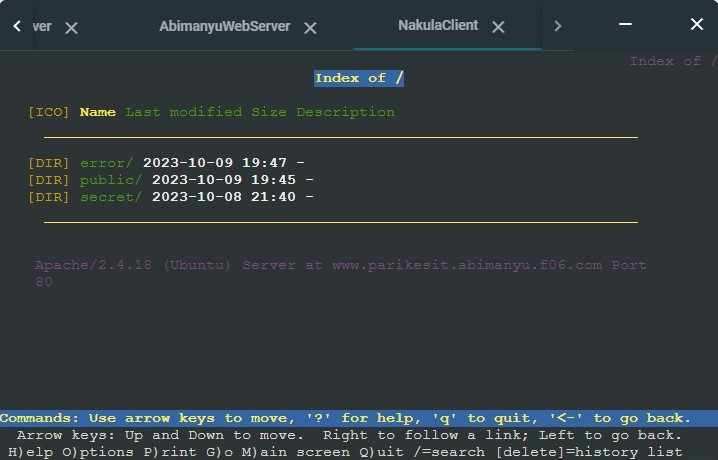

## Soal-16

> Buatlah suatu konfigurasi virtual host agar file asset `www.parikesit.abimanyu.yyy.com/public/js` menjadi `www.parikesit.abimanyu.yyy.com/js`

Lakukan konfigurasi di Abimanyu dengan skrip `js.sh` 

```shell
echo '<VirtualHost *:80>

        ServerAdmin webmaster@localhost
        DocumentRoot /var/www/parikesit.abimanyu.f06
        ServerName parikesit.abimanyu.f06.com
        ServerAlias www.parikesit.abimanyu.f06.com

        <Directory /var/www/parikesit.abimanyu.f06/public>
            Options +Indexes
        </Directory>

        <Directory /var/www/parikesit.abimanyu.f06/secret>
            Options -Indexes
        </Directory>

        Alias "/js" "/var/www/parikesit.abimanyu.f06/public/js"

        ErrorDocument 403 /error/403.html
        ErrorDocument 404 /error/404.html

        ErrorLog ${APACHE_LOG_DIR}/error.log
        CustomLog ${APACHE_LOG_DIR}/access.log combined

</VirtualHost>' > /etc/apache2/sites-available/parikesit.abimanyu.f06.com.conf

service apache2 restart
```

Lalu lakukan konfigurasi di Nakula/Sadewa dengan skrip `js.sh` 

```shell
lynx www.parikesit.abimanyu.f06.com/js
```

Hasil
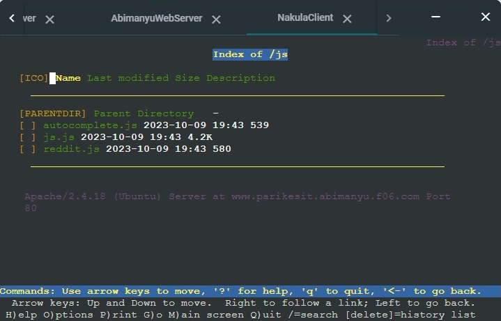

## Soal-17

> Agar aman, buatlah konfigurasi agar `www.rjp.baratayuda.abimanyu.yyy.com` hanya dapat diakses melalui port `14000` dan `14400`.

untuk membuat `www.rjp.baratayuda.abimanyu.yyy.com` hanya dapat diakses melalui port `14000` dan `14400`, melakukan konfigurasi pada Abimanyu menggunakan skrip `rjp.sh` yang berisi sebagai berikut

```shell
touch /etc/apache2/sites-available/14000.conf
echo '<VirtualHost *:14000>

        ServerAdmin webmaster@localhost
        DocumentRoot /var/www/rjp.baratayuda.abimanyu.f06
        ServerName rjp.baratayuda.abimanyu.f06.com
        ServerAlias www.rjp.baratayuda.abimanyu.f06.com

        ErrorLog ${APACHE_LOG_DIR}/error.log
        CustomLog ${APACHE_LOG_DIR}/access.log combined

</VirtualHost>' > /etc/apache2/sites-available/14000.conf

touch /etc/apache2/sites-available/14400.conf
echo '<VirtualHost *:14400>

        ServerAdmin webmaster@localhost
        DocumentRoot /var/www/rjp.baratayuda.abimanyu.f06
        ServerName rjp.baratayuda.abimanyu.f06.com
        ServerAlias www.rjp.baratayuda.abimanyu.f06.com

        ErrorLog ${APACHE_LOG_DIR}/error.log
        CustomLog ${APACHE_LOG_DIR}/access.log combined

</VirtualHost>' > /etc/apache2/sites-available/14400.conf

a2ensite 14000.conf
a2ensite 14400.conf

echo 'Listen 80
Listen 8002
Listen 14000
Listen 14400

<IfModule ssl_module>
        Listen 443
</IfModule>

<IfModule mod_gnutls.c>
        Listen 443
</IfModule>' > /etc/apache2/ports.conf

service apache2 restart
```

Setelah itu masukkan skrip `baratayuda.sh` pada Nakula/Sadewa

```shell
lynx www.rjp.baratayuda.abimanyu.f06.com:14000
```

Hasil
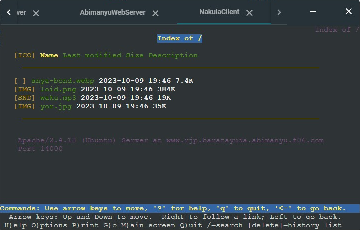

## Soal-18

> Untuk mengaksesnya buatlah autentikasi username berupa `“Wayang”` dan password `“baratayudayyy”` dengan yyy merupakan kode kelompok. Letakkan DocumentRoot pada `/var/www/rjp.baratayuda.abimanyu.yyy`.

Masukkan konfigurasi pada Abimanyu dengan skrip `password.sh` yang berisi sebagai berikut.

```shell
htpasswd -c /var/www/rjp.baratayuda.abimanyu.f06/password Wayang

echo '<VirtualHost *:14000>

        ServerAdmin webmaster@localhost
        DocumentRoot /var/www/rjp.baratayuda.abimanyu.f06
        ServerName rjp.baratayuda.abimanyu.f06.com
        ServerAlias www.rjp.baratayuda.abimanyu.f06.com

        <Directory /var/www/rjp.baratayuda.abimanyu.f06>
                AuthType Basic
                AuthName "Authentication Required"
                AuthUserFile /var/www/rjp.baratayuda.abimanyu.f06/password
                Require valid-user
        </Directory>

        <Files "password">
                Order allow,deny
                Deny from all
        </Files>

        ErrorLog ${APACHE_LOG_DIR}/error.log
        CustomLog ${APACHE_LOG_DIR}/access.log combined

</VirtualHost>' > /etc/apache2/sites-available/14000.conf

echo '<VirtualHost *:14400>

        ServerAdmin webmaster@localhost
        DocumentRoot /var/www/rjp.baratayuda.abimanyu.f06
        ServerName rjp.baratayuda.abimanyu.f06.com
        ServerAlias www.rjp.baratayuda.abimanyu.f06.com

        <Directory /var/www/rjp.baratayuda.abimanyu.f06>
                AuthType Basic
                AuthName "Authentication Required"
                AuthUserFile /var/www/rjp.baratayuda.abimanyu.f06/password
                Require valid-user
        </Directory>

        <Files "password">
                Order allow,deny
                Deny from all
        </Files>

        ErrorLog ${APACHE_LOG_DIR}/error.log
        CustomLog ${APACHE_LOG_DIR}/access.log combined

</VirtualHost>' > /etc/apache2/sites-available/14400.conf

service apache2 restart
```

Setelah itu masukkan skrip `baratayuda.sh` pada Nakula/Sadewa

```shell
lynx www.rjp.baratayuda.abimanyu.f06.com:14400
```
Hasil
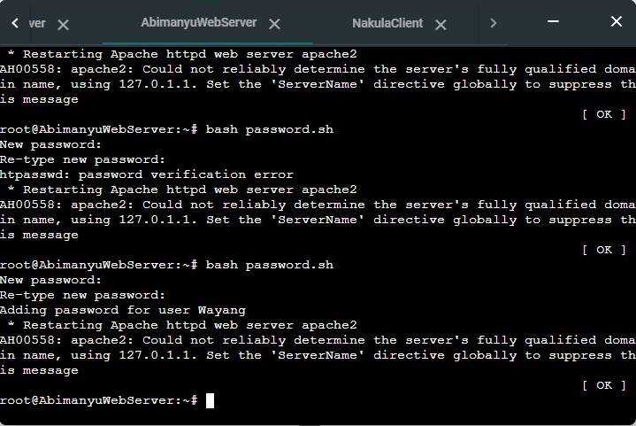

## Soal-19

> Buatlah agar setiap kali mengakses IP dari Abimanyu akan secara otomatis dialihkan ke `www.abimanyu.yyy.com` (alias)

agar setiap kali mengakses IP dari Abimanyu akan secara otomatis dialihkan ke `www.abimanyu.yyy.com` jalankan skrip `redirect.sh` di Abimanyu yang berisi sebagai berikut.

```shell
echo 'RewriteEngine On

RewriteCond %{REQUEST_FILENAME} !-f
RewriteCond %{REQUEST_FILENAME} !-d
RewriteRule ^(.*)$ index.php/$1 [L]

RewriteCond %{HTTP_HOST} !^www\. [NC]
RewriteRule ^(.*)$ http://www.%{HTTP_HOST}/$1 [R=301,L]' > /var/www/abimanyu.f06/.htaccess

service apache2 restart
```

Setelah itu masukkan skrip `apachetes.sh` pada Nakula/Sadewa Client.

```shell
lynx abimanyu.f06.com
```
Hasil
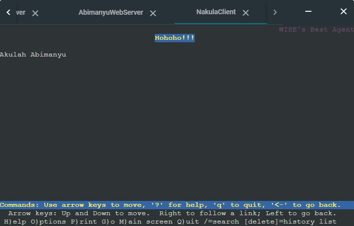

## Soal-20

> Karena website `www.parikesit.abimanyu.yyy.com` semakin banyak pengunjung dan banyak gambar gambar random, maka ubahlah request gambar yang memiliki substring `“abimanyu”` akan diarahkan menuju `abimanyu.png`.

agar gambar yang memiliki substring `“abimanyu”` akan diarahkan menuju `abimanyu.png`, jalankan konfigurasi di Abimanyu dengan skrip `png.sh` yang berisi sebagai berikut.

```shell
a2enmod rewrite

echo '<VirtualHost *:80>

        ServerAdmin webmaster@localhost
        DocumentRoot /var/www/parikesit.abimanyu.f06
        ServerName parikesit.abimanyu.f06.com
        ServerAlias www.parikesit.abimanyu.f06.com

        <Directory /var/www/parikesit.abimanyu.f06/public>
                Options +Indexes
        </Directory>

        <Directory /var/www/parikesit.abimanyu.f06/secret>
                Options -Indexes
        </Directory>

        Alias "/js" "/var/www/parikesit.abimanyu.f06/public/js"

        <Directory /var/www/parikesit.abimanyu.f06>
                Options +FollowSymLinks -Multiviews
                AllowOverride All
        </Directory>

        RewriteEngine On
        RewriteRule .*abimanyu.* /public/images/abimanyu.png [L]

        ErrorDocument 403 /error/403.html
        ErrorDocument 404 /error/404.html

        ErrorLog ${APACHE_LOG_DIR}/error.log
        CustomLog ${APACHE_LOG_DIR}/access.log combined

</VirtualHost>' > /etc/apache2/sites-available/parikesit.abimanyu.f06.com.conf

service apache2 restart
```

Setelah itu masukkan skrip `png.sh` pada Nakula/Sadewa.

```shell
curl -I www.parikesit.abimanyu.f06.com/public/images/abimanyu-student.jpg
curl -I www.parikesit.abimanyu.f06.com/public/images/not-abimanyu.png
curl -I www.parikesit.abimanyu.f06.com/public/images/abimanyu
curl -I www.parikesit.abimanyu.f06.com/public/images/abimanyu.png
```
Hasil
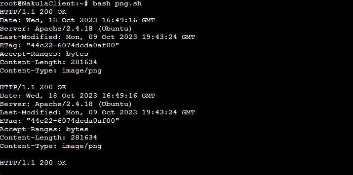
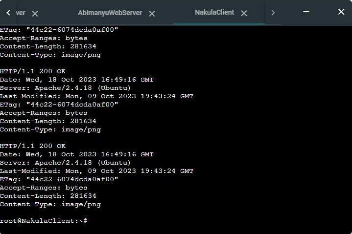


